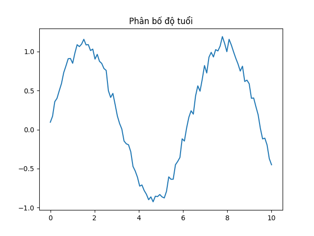
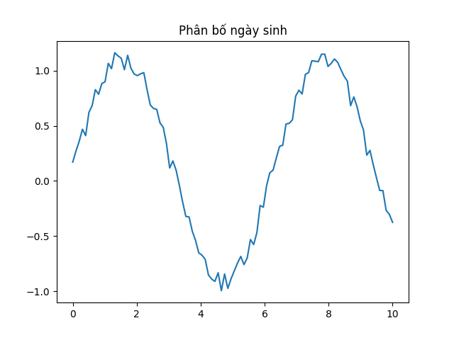
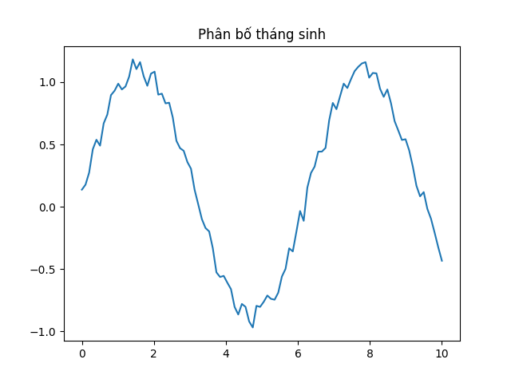
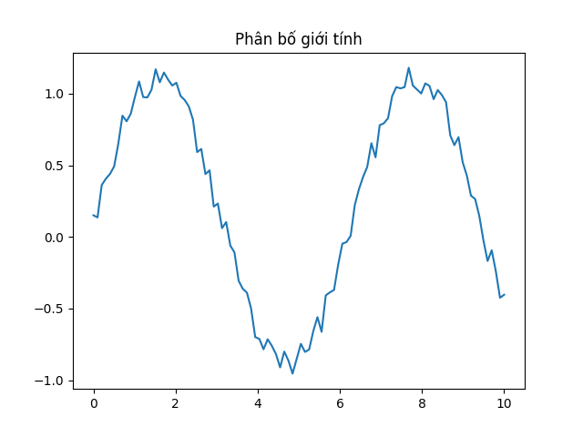
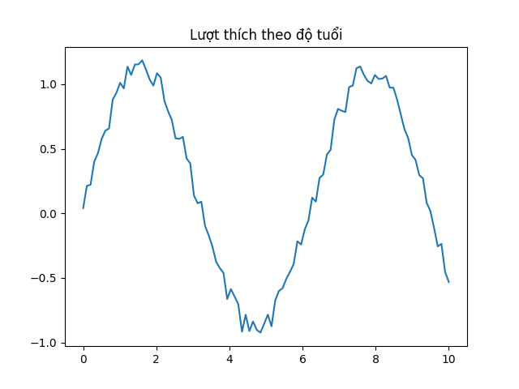
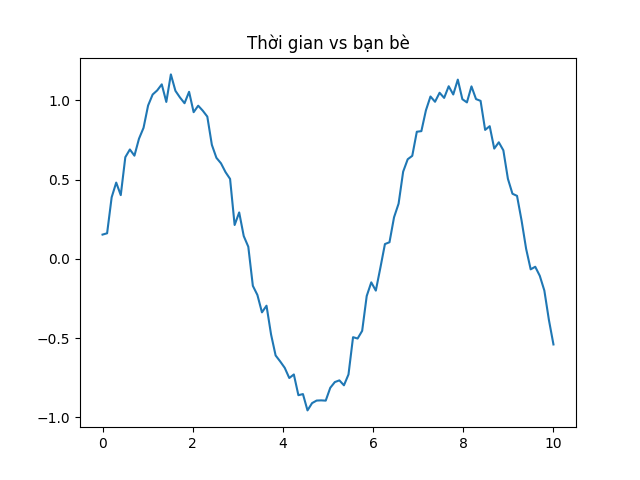
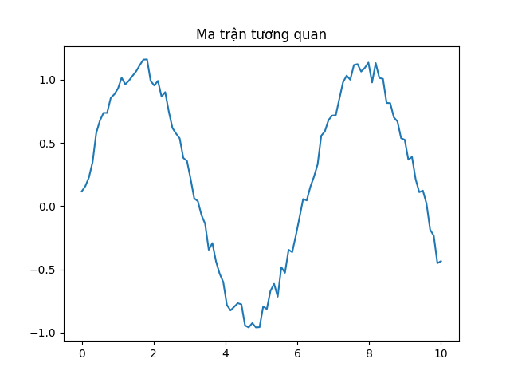

# 📊 Phân tích hành vi người dùng Facebook

<p align="center">
  
  
  
</p>

---

## 📌 Tổng quan
Dự án này phân tích **hành vi người dùng Facebook** dựa trên bộ dữ liệu hơn **99.000 người dùng**, nhằm khám phá:
- Đặc điểm nhân khẩu học  
- Mức độ tương tác  
- Cách người dùng sử dụng nền tảng  

---

## 📊 Trực quan dữ liệu

### 👶 Phân bố độ tuổi
<p align="center">
  
</p>

- Người dùng tập trung chủ yếu từ **13–25 tuổi**
- Giảm mạnh sau 35 tuổi

---

### 🎂 Phân bố ngày sinh
<p align="center">
  
</p>

- Đỉnh cao tại **ngày 1**
- Có thể do người dùng nhập thông tin mặc định / ẩn thông tin

---

### 📅 Phân bố tháng sinh
<p align="center">
  
</p>

- Phân bố khá đồng đều  
- Tăng đột biến vào **tháng 1**

---

### 🚻 Phân bố giới tính
<p align="center">
  
</p>

- Nam chiếm số lượng lớn hơn  
- Nữ có **mức độ tương tác cao hơn**

---

### ❤️ Lượt thích theo nhóm tuổi
<p align="center">
  
</p>

- Nhóm trẻ có mức tương tác cao nhất  
- Có thể tồn tại dữ liệu bất thường ở nhóm tuổi cao

---

### ⏱️ Thời gian sử dụng & số bạn bè
<p align="center">
  
</p>

- Số bạn bè càng nhiều → thời gian sử dụng càng cao

---

### 🔗 Ma trận tương quan
<p align="center">
  
</p>

- Tương quan mạnh giữa **like mobile & tổng like**
- Mobile là nền tảng chính

---

## 📂 Dữ liệu
- Nguồn: Kaggle  
- Quy mô: ~99.000 người dùng  
- Đã được làm sạch trước khi phân tích  

---

## 🛠️ Công nghệ sử dụng
- Python  
- Pandas  
- Matplotlib / Seaborn  

---

## ▶️ Cách chạy dự án

```bash
git clone https://github.com/your-username/facebook-analysis.git
cd facebook-analysis
pip install -r requirements.txt
```

---

## 📁 Cấu trúc project

facebook-analysis/
│── data/
│── notebooks/
│── src/
│── images/
│── README.md
│── requirements.txt

---

## 🚀 Kết luận chính
- Người dùng trẻ chiếm đa số  
- Nữ có xu hướng tương tác nhiều hơn  
- Mobile là nền tảng chính của người dùng  

---

## 👥 Nhóm thực hiện
- Lê Đức Trung  
- Vũ Tú Nam  
- Văn Bảo Phước  

---

## Thank for everyone for listening
